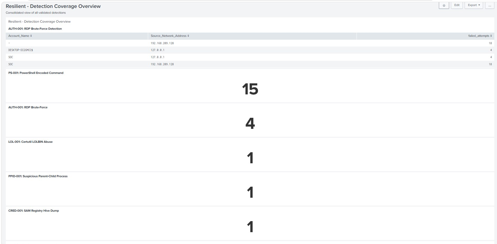

<div align="center">

# 🔎 Resilient — Advanced Detection Engineering 001

**Design, build, test, tune and document a prioritized Splunk detection pack — validated against live attack simulations.**




</div>

---

## Overview

A simulated mid-sized organization with inconsistent endpoint visibility and noisy, low-fidelity alerts needed a reliable detection baseline. This project walks the **full detection engineering lifecycle**: risk definition → telemetry validation → attack simulation → SPL detection → false-positive testing → tuning → MITRE mapping → dashboard.

> **Authorization:** every attack simulation was run only against self-owned, isolated lab systems for educational and portfolio purposes.

## Lab Environment

| Component | Role |
|---|---|
| Windows 10 endpoint | Sysmon + Windows Security auditing + PowerShell Script Block Logging + Splunk Universal Forwarder |
| Kali Linux | Attack host |
| Splunk | Indexing, search, dashboards |
| VMware Workstation | Isolated virtual network |

## Detection Pack

| ID | Detection | MITRE ATT&CK | Data source | Status |
|---|---|---|---|---|
| [AUTH-001](04_Detections/splunk/AUTH-001_bruteforce_EN.md) | RDP brute-force | T1110.001 | Security 4625 | ✅ Validated |
| [PS-001](04_Detections/splunk/PS-001_encoded_command.md) | PowerShell encoded command | T1059.001 / T1027 | PowerShell 4104 | ✅ Validated |
| [LOL-001](04_Detections/splunk/LOL-001_certutil_abuse.md) | certutil abuse | T1105 / T1218.001 | Sysmon 1 | ✅ Validated |
| [PPID-001](04_Detections/splunk/PPID-001_suspicious_parent_child.md) | Suspicious parent-child process | T1059 / T1036 | Sysmon 1 | ✅ Validated (tuned) |
| [CRED-001](04_Detections/splunk/CRED-001_sam_dump.md) | SAM registry hive dump | T1003.002 | Sysmon 1 | ✅ Validated |
| [PERSIST-001](04_Detections/splunk/PERSIST-001_scheduled_task.md) | Scheduled task as SYSTEM | T1053.005 | Sysmon 1 | ✅ Validated |
| [LAT-001](04_Detections/splunk/LAT-001_lateral_movement.md) | Lateral movement (WMI / Impacket) | T1021.006 / T1047 | Security 4624 | ✅ Validated |
| [NET-001](04_Detections/splunk/NET-001_suspicious_outbound.md) | Suspicious outbound connection | T1071 / T1571 | Sysmon 3 | ✅ Validated |
| [STAGE-001](04_Detections/splunk/STAGE-001_data_staging.md) | Data staging (archive) | T1560.001 | PowerShell 4104 | ✅ Validated (tuned) |
| [EVASION-001](04_Detections/splunk/EVASION-001_log_clearing.md) | Event log clearing | T1070.001 | System 104 | ✅ Validated |

Full mapping and gaps: [08_MITRE/coverage_matrix.md](08_MITRE/coverage_matrix.md)

## 🔁 Methodology

1. **Telemetry first** — confirm data and field extraction before writing any rule (`02_Telemetry`).
2. **Attack simulation** — run each technique from Kali against the lab endpoint (`03_Attack_Scenarios`).
3. **Detection** — write and validate the SPL against the live events (`04_Detections`).
4. **False-positive testing** — run benign activity and tune where needed (`06_Tuning`). PPID-001 and STAGE-001 were tuned.
5. **Mapping & reporting** — MITRE matrix and consolidated dashboard (`08_MITRE`, `09_Dashboards`).

## Known Gaps (documented, not hidden)

- LSASS memory access (T1003.001) was not reliably visible due to Sysmon ProcessAccess filtering.
- No coverage for Exfiltration (TA0010) or Impact (TA0040).
- AUTH-001 and LAT-001 rely on a single source IP, so distributed attacks would evade them.
- NET-001 covers only one hardcoded port (4444).

## 📁 Repository Layout

```text
.
├── 00_Project/        Scope and requirements
├── 01_Architecture/   Lab connectivity evidence
├── 02_Telemetry/      Telemetry validation screenshots
├── 03_Attack_Scenarios/  Attack simulation evidence
├── 04_Detections/     SPL detections + hunting/query screenshots
├── 06_Tuning/         False-positive testing evidence
├── 08_MITRE/          ATT&CK coverage matrix
└── 09_Dashboards/     Splunk dashboard screenshots
```

> The final written report is still in progress (see `00_Project/requirements.md`).

## Notes

- The SPL examples contain the lab hostname `DESKTOP-DI2GMCC`. Replace it with your own host or a macro when reusing them.
- The Hydra screenshot has the lab account password redacted.
- Lab IPs (`192.168.209.x`) are private and only valid inside the isolated lab.

---

<div align="center">Resilient SOC Team · Advanced Detection Engineering 001 · September 2026</div>
